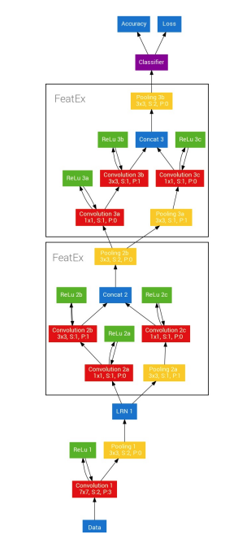
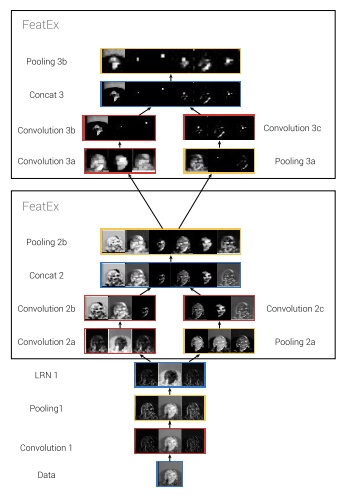

# AM-Backend
Para utilizar o projeto em mac e linux acesse a branch:
`MacLinuxProject`
## Setup
- Instale a versão 3.8.13 do Python 
  - Pelo site oficial [Python.org](https://www.python.org/)
  - Ou por bibliotecas como pyenv [Github](https://github.com/pyenv/pyenv) (para Linux e Mac) pyenv-win [Github](https://github.com/pyenv-win/pyenv-win) (para windows)
- Instale o pipenv `pip install pipenv`
- Dentro da pasta do repositório, execute os seguintes comandos
  - `pipenv lock` para gerar o arquivo Pipenv.lock
  - `pipenv sync` para instalar as bibliotecas necessárias (flask, flask-cors e fastai)

## Rodando
- No diretório do projeto:
  - `pipenv shell` para utilizar o ambiente virtual do projeto 
  - `py server.py` para rodar o servidor da API
  - `exit` para sair do ambiente virtual

## API e servidor
A API é toda feita na biblioteca Flask, na porta 9874 e as requisições são feitas na rota `/` (apenas POST).
#### Exemplo de resposta
```json
{
  "result": "HAPPY"
}
```

# Notebook.ipynb
Este notebook é uma implementações da arquitetura encontrada no artigo [DeXpression: Deep Convolutional Neural Network for Expression Recognition](https://paperswithcode.com/paper/dexpression-deep-convolutional-neural-network), juntamente com o dataset da [fer13](https://www.kaggle.com/datasets/gauravsharma99/fer13-cleaned-dataset). A atual acuracia do modelo gerado a partir deste notebook é de 64.8%, utilizando somente 5 categorias de emoções, das 11 iniciais propostas pelo artigo em questão. Acreditamos que a falta de acuracia do modelo é devido ao tamanho improprio das imagens do dataset que foi utilizado no treinamento, juntamente com a quantidade de classes. 

A utilização do dataset [fer13](https://www.kaggle.com/datasets/gauravsharma99/fer13-cleaned-dataset) na arquitetura Dexpression, só foi possível devido algumas alterações no arquitetura original. 

## Arquitetura DeXpression



A arquitetura de Rede Neural Convolucional profunda proposta (representada na figura acima) consiste em quatro partes. A primeira parte pré-processa automaticamente os dados. Esse começa com a Convolução 1, que aplica 64 filtros. A próxima camada é o Pooling 1, que reduz a amostragem as imagens e então elas são normalizadas pelo LRN 1. O próximos passos são os dois FeatEx (Extração Paralela de Recursos Block), destacados na Figura 4. São os blocos núcleo da arquitetura proposta e descrito mais tarde em
esta seção. As características extraídas por esses blocos são
encaminhados para uma camada totalmente conectada, que os utiliza
classificar a entrada nas diferentes emoções.


